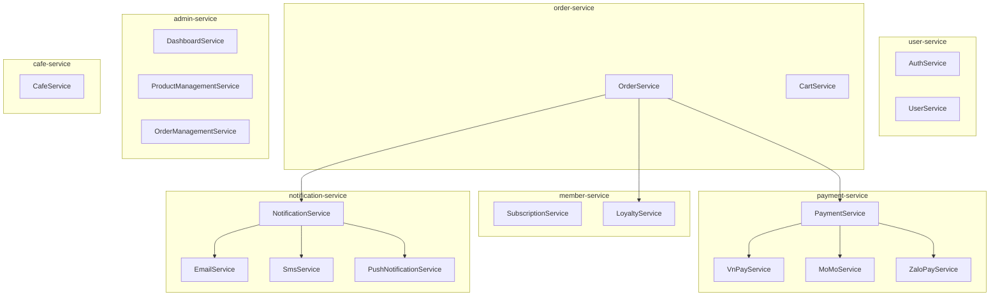

# AI Café Platform - Entity, Service, Repository Relationships

## 1. Tổng quan Kiến trúc Layer trong Java Microservices

```
┌─────────────────────────────────────────────────────────────────────────────┐
│                        CONTROLLER LAYER                                     │
│  (Nhận HTTP Request, Validate Input, Gọi Service, Trả HTTP Response)     │
│  - @RestController                                                         │
│  - @RequestMapping                                                         │
│  - @Valid @RequestBody                                                     │
└─────────────────────────────────────────────────────────────────────────────┘
                                    │
                                    ▼
┌─────────────────────────────────────────────────────────────────────────────┐
│                         SERVICE LAYER                                       │
│  (Business Logic, Transaction Management, Cross-Service Calls)              │
│  - @Service                                                                │
│  - @Transactional                                                          │
│  - Gọi nhiều Repository                                                   │
│  - Validation & Business Rules                                              │
└─────────────────────────────────────────────────────────────────────────────┘
                                    │
                                    ▼
┌─────────────────────────────────────────────────────────────────────────────┐
│                       REPOSITORY LAYER                                     │
│  (Data Access, Database Operations)                                        │
│  - @Repository (extends JpaRepository)                                    │
│  - @Query (JPQL / Native SQL)                                             │
│  - CRUD Operations                                                         │
└─────────────────────────────────────────────────────────────────────────────┘
                                    │
                                    ▼
┌─────────────────────────────────────────────────────────────────────────────┐
│                         ENTITY LAYER                                       │
│  (Domain Objects, JPA Mapping, Database Table Representation)             │
│  - @Entity, @Table                                                        │
│  - @Id, @Column, @OneToMany, @ManyToOne                                 │
│  - @Builder, @Getter, @Setter (Lombok)                                   │
└─────────────────────────────────────────────────────────────────────────────┘
```

---

## 2. Chi tiết từng Layer

### 2.1 ENTITY LAYER

**Entity** là đại diện cho dữ liệu trong database, ánh xạ trực tiếp vào table.

```java
@Entity
@Table(name = "orders", indexes = {...})
@EntityListeners(AuditingEntityListener.class)
@Getter @Setter
@NoArgsConstructor @AllArgsConstructor
@Builder
public class Order {
    
    @Id
    @GeneratedValue(strategy = GenerationType.UUID)
    private UUID id;
    
    @Column(name = "order_number", nullable = false, unique = true)
    private String orderNumber;
    
    // Relationships
    @OneToMany(mappedBy = "order", cascade = CascadeType.ALL, fetch = FetchType.LAZY)
    @Builder.Default
    private List<OrderItem> items = new ArrayList<>();
    
    // Helper method
    public void addItem(OrderItem item) {
        items.add(item);
        item.setOrder(this);  // Bidirectional relationship
    }
}
```

**Các loại Entity trong hệ thống:**

| Service | Entities |
|---------|----------|
| **user-service** | User, UserProfile, UserCredit, UserDevice, RefreshToken |
| **order-service** | Order, OrderItem, Cart, CartItem, Promotion |
| **payment-service** | Payment, PaymentTransaction |
| **member-service** | Subscription, Loyalty, Product, Category |
| **admin-service** | AdminEntities (Dashboard, Reports) |
| **common** | Company, Cafe, Address |

---

### 2.2 REPOSITORY LAYER

**Repository** cung cấp các phương thức CRUD và truy vấn database.

```java
@Repository
public interface OrderRepository extends JpaRepository<Order, UUID> {
    
    // Spring Data tự động tạo query từ method name
    Optional<Order> findByOrderNumber(String orderNumber);
    Optional<Order> findByUserId(UUID userId);
    List<Order> findByStatus(String status);
    
    // Custom JPQL Query
    @Query("SELECT o FROM Order o LEFT JOIN FETCH o.items WHERE o.id = :id")
    Optional<Order> findByIdWithItems(UUID id);
    
    // Aggregation
    @Query("SELECT COUNT(o) FROM Order o WHERE o.userId = :userId AND o.status = :status")
    long countByUserIdAndStatus(UUID userId, String status);
    
    // Native SQL (khi cần)
    @Query(value = "SELECT * FROM orders WHERE ...", nativeQuery = true)
    List<Order> findCustomQuery(...);
}
```

**Repository pattern trong hệ thống:**

```java
// Trong Repositories.java (nhiều repository cùng file)
@Repository
public interface CartRepository extends JpaRepository<Cart, UUID> {
    Optional<Cart> findByUserIdAndCafeId(UUID userId, UUID cafeId);
    @Query("SELECT c FROM Cart c LEFT JOIN FETCH c.items WHERE c.id = :id")
    Optional<Cart> findByIdWithItems(UUID id);
    void deleteByUserIdAndCafeId(UUID userId, UUID cafeId);
}

@Repository
public interface CartItemRepository extends JpaRepository<CartItem, UUID> {
    List<CartItem> findByCartId(UUID cartId);
    Optional<CartItem> findByCartIdAndProductId(UUID cartId, UUID productId);
    void deleteAllByCartId(UUID cartId);
}

@Repository
public interface PromotionRepository extends JpaRepository<Promotion, UUID> {
    Optional<Promotion> findByCode(String code);
    List<Promotion> findByStatusAndEndDateAfter(String status, Instant date);
}

@Repository
public interface ProductRepository extends JpaRepository<Product, UUID> {
    List<Product> findByCompanyIdAndIsActiveTrue(UUID companyId);
    Optional<Product> findByIdAndCompanyId(UUID id, UUID companyId);
    List<Product> findByCategoryIdAndIsActiveTrue(UUID categoryId);
}
```

---

### 2.3 SERVICE LAYER

**Service** chứa business logic, quản lý transaction, và orchestrate giữa các repository.

```java
@Service
@RequiredArgsConstructor  // Lombok: tự tạo constructor với final fields
@Slf4j                   // Lombok: tự tạo logger
public class OrderService {
    
    // Dependency Injection qua Constructor
    private final OrderRepository orderRepository;
    private final CartRepository cartRepository;
    private final CartItemRepository cartItemRepository;
    private final PromotionRepository promotionRepository;
    private final ObjectMapper objectMapper;
    
    @Transactional  // Mỗi method là 1 transaction
    public Order createOrder(...) {
        // 1. Validate & Business Logic
        Cart cart = cartRepository.findByUserIdAndCafeId(userId, cafeId)
                .orElseThrow(() -> new ApiException(...));
        
        // 2. Tính toán
        double subtotal = cart.getSubtotal();
        double discountAmount = applyPromotion(cart, promoCode);
        double taxAmount = (subtotal - discountAmount) * 0.10;
        double totalAmount = subtotal - discountAmount + taxAmount;
        
        // 3. Tạo Entity
        Order order = Order.builder()
                .orderNumber(generateOrderNumber())
                .status("pending")
                .totalAmount(totalAmount)
                .build();
        
        // 4. Save
        order = orderRepository.save(order);
        
        // 5. Cleanup
        cartItemRepository.deleteAllByCartId(cart.getId());
        cartRepository.delete(cart);
        
        return order;
    }
    
    @Transactional(readOnly = true)  // Read-only transaction (tối ưu performance)
    public Order getOrder(UUID orderId) {
        return orderRepository.findByIdWithItems(orderId)
                .orElseThrow(() -> new ApiException(...));
    }
    
    @Transactional
    public Order confirmOrder(UUID orderId) {
        Order order = getOrder(orderId);
        
        // Business Rule: Chỉ order "pending" mới confirm được
        if (!"pending".equals(order.getStatus())) {
            throw new ApiException(HttpStatus.BAD_REQUEST, "INVALID_STATUS", ...);
        }
        
        order.setStatus("confirmed");
        order.setConfirmedAt(Instant.now());
        return orderRepository.save(order);
    }
    
    // Private methods cho business logic phức tạp
    private double applyPromotion(Cart cart, String promoCode) {
        Promotion promo = promotionRepository.findByCode(promoCode)
                .orElseThrow(() -> new ApiException(...));
        
        // Validate promotion
        Instant now = Instant.now();
        if (promo.getStartDate() != null && now.isBefore(promo.getStartDate())) {
            throw new ApiException(HttpStatus.BAD_REQUEST, "PROMO_NOT_STARTED", ...);
        }
        if (promo.getEndDate() != null && now.isAfter(promo.getEndDate())) {
            throw new ApiException(HttpStatus.BAD_REQUEST, "PROMO_EXPIRED", ...);
        }
        
        // Calculate discount
        double subtotal = cart.getSubtotal();
        if ("percentage".equals(promo.getDiscountType())) {
            return subtotal * (promo.getDiscountValue() / 100);
        } else {
            return promo.getDiscountValue();
        }
    }
}
```

---

### 2.4 CONTROLLER LAYER

**Controller** nhận HTTP request, validate input, gọi service, và trả response.

```java
@RestController
@RequestMapping("/v1")
@RequiredArgsConstructor
public class OrderController {
    
    private final OrderService orderService;
    
    // POST /v1/orders
    @PostMapping("/orders")
    public ResponseEntity<ApiResponse<OrderResponse>> createOrder(
            @Valid @RequestBody CreateOrderRequest request,
            @RequestHeader("X-User-ID") UUID userId) {
        
        Order order = orderService.createOrder(
                userId,
                request.getCompanyId(),
                request.getCafeId(),
                request.getOrderType(),
                request.getDeliveryAddressId(),
                request.getCustomerNote(),
                request.getPromoCode()
        );
        
        return ResponseEntity.ok(ApiResponse.ok(toResponse(order)));
    }
    
    // GET /v1/orders
    @GetMapping("/orders")
    public ResponseEntity<ApiResponse<List<OrderResponse>>> getOrders(
            @RequestHeader("X-User-ID") UUID userId,
            @RequestParam(defaultValue = "0") int page,
            @RequestParam(defaultValue = "20") int size) {
        
        List<Order> orders = orderService.getUserOrders(userId, page, size);
        return ResponseEntity.ok(ApiResponse.ok(
                orders.stream().map(this::toResponse).toList()
        ));
    }
    
    // PUT /v1/orders/:id/confirm
    @PutMapping("/orders/{id}/confirm")
    public ResponseEntity<ApiResponse<OrderResponse>> confirmOrder(@PathVariable UUID id) {
        Order order = orderService.confirmOrder(id);
        return ResponseEntity.ok(ApiResponse.ok(toResponse(order)));
    }
    
    // POST /v1/orders/:id/cancel
    @PostMapping("/orders/{id}/cancel")
    public ResponseEntity<ApiResponse<OrderResponse>> cancelOrder(
            @PathVariable UUID id,
            @RequestBody(required = false) Map<String, String> body) {
        
        String reason = body != null ? body.get("reason") : null;
        Order order = orderService.cancelOrder(id, reason);
        return ResponseEntity.ok(ApiResponse.ok(toResponse(order)));
    }
    
    // DTO/Response Mapping
    private OrderResponse toResponse(Order order) {
        return OrderResponse.builder()
                .id(order.getId())
                .orderNumber(order.getOrderNumber())
                .status(order.getStatus())
                .totalAmount(order.getTotalAmount())
                .createdAt(order.getCreatedAt())
                .build();
    }
}
```

---

## 3. Mối liên hệ giữa các Layer

### 3.1 Biểu đồ Sequence - Create Order Flow

```
┌─────────┐     ┌──────────────┐     ┌───────────┐     ┌────────────┐     ┌──────────┐
│  User   │     │  Controller  │     │  Service  │     │ Repository│     │   DB    │
└────┬────┘     └──────┬───────┘     └─────┬─────┘     └─────┬──────┘     └────┬────┘
     │                  │                    │                │               │
     │ POST /orders     │                    │                │               │
     │─────────────────▶│                    │                │               │
     │                  │                    │                │               │
     │                  │ createOrder()      │                │               │
     │                  │───────────────────▶│                │               │
     │                  │                    │                │               │
     │                  │                    │ findByUserId()  │               │
     │                  │                    │──────────────────────────────────▶│
     │                  │                    │◀──────────────────────────────────│
     │                  │                    │                │               │
     │                  │                    │ findByCode()   │               │
     │                  │                    │──────────────────────────────────▶│
     │                  │                    │◀──────────────────────────────────│
     │                  │                    │                │               │
     │                  │                    │   calculate    │               │
     │                  │                    │   discount    │               │
     │                  │                    │    (local)    │               │
     │                  │                    │                │               │
     │                  │                    │ save(order)   │               │
     │                  │                    │──────────────────────────────────▶│
     │                  │                    │◀──────────────────────────────────│
     │                  │                    │                │               │
     │                  │                    │deleteCart()   │               │
     │                  │                    │──────────────────────────────────▶│
     │                  │                    │                │               │
     │                  │   return order    │                │               │
     │                  │◀──────────────────│                │               │
     │                  │                    │                │               │
     │ 200 OK          │                    │                │               │
     │◀────────────────│                    │                │               │
     │                  │                    │                │               │
```

### 3.2 Class Diagram Relationships

```mermaid
classDiagram
    class OrderController {
        -OrderService orderService
        +createOrder()
        +getOrders()
        +confirmOrder()
        +cancelOrder()
    }
    
    class OrderService {
        -OrderRepository orderRepository
        -CartRepository cartRepository
        -CartItemRepository cartItemRepository
        -PromotionRepository promotionRepository
        +createOrder()
        +getOrder()
        +confirmOrder()
        +cancelOrder()
        -applyPromotion()
        -generateOrderNumber()
    }
    
    class OrderRepository {
        +findByOrderNumber()
        +findByIdWithItems()
        +findByUserIdOrderByCreatedAtDesc()
        +save()
        +delete()
    }
    
    class CartRepository {
        +findByUserIdAndCafeId()
        +findByIdWithItems()
    }
    
    class CartItemRepository {
        +findByCartId()
        +deleteAllByCartId()
    }
    
    class PromotionRepository {
        +findByCode()
    }
    
    class Order {
        +UUID id
        +String orderNumber
        +String status
        +Double totalAmount
        +List~OrderItem~ items
        +addItem()
    }
    
    class OrderItem {
        +UUID id
        +UUID orderId
        +Integer quantity
        +Double unitPrice
    }
    
    class Cart {
        +UUID id
        +UUID userId
        +Double subtotal
        +List~CartItem~ items
    }
    
    class CartItem {
        +UUID id
        +UUID cartId
        +UUID productId
        +Integer quantity
    }
    
    class Promotion {
        +UUID id
        +String code
        +String discountType
        +Double discountValue
    }
    
    %% Relationships
    OrderController --> OrderService : uses
    OrderService --> OrderRepository : uses
    OrderService --> CartRepository : uses
    OrderService --> CartItemRepository : uses
    OrderService --> PromotionRepository : uses
    
    OrderService --> Order : manages
    OrderService --> Cart : reads
    OrderService --> Promotion : validates
    
    Order --> OrderItem : "1:N"
    Cart --> CartItem : "1:N"
    OrderItem --> Order : "N:1"
    CartItem --> Cart : "N:1"
```

### 3.3 Service Dependencies (Cross-Service)



---

## 4. Data Flow trong các Use Case

### 4.1 Create Order Flow

```
┌──────────────────────────────────────────────────────────────────────────────────────┐
│                            CREATE ORDER FLOW                                         │
├──────────────────────────────────────────────────────────────────────────────────────┤
│                                                                                      │
│  Client                  Controller              Service                Repository   │
│  ─────                  ──────────              ───────                ──────────  │
│                                                                                      │
│  POST /v1/orders        createOrder()           createOrder()          findByUserId │
│  {                      ────────────           ─────────────          ──────────   │
│    cafeId,              validate                validate cart          save(order)  │
│    orderType,            request ─────────────▶ cartRepository         ──────────   │
│    promoCode             ────────────           ────────────          delete(cart) │
│  }                      ────────────           applyPromotion                          │
│                         toResponse             promotionRepository                 │
│                                              ────────────                           │
│                                              save(order                            │
│                                                                                      │
└──────────────────────────────────────────────────────────────────────────────────────┘
```

### 4.2 Payment Flow

```
┌──────────────────────────────────────────────────────────────────────────────────────┐
│                            PAYMENT FLOW                                            │
├──────────────────────────────────────────────────────────────────────────────────────┤
│                                                                                      │
│  Client                  Controller              Service                External    │
│  ─────                  ──────────              ───────                ────────    │
│                                                                                      │
│  POST /v1/payments       createPayment()        createPayment()       VNPay API   │
│  {                      ──────────────          ──────────────        ─────────   │
│    orderId,              ──────────────         orderRepository       redirect    │
│    method: vnpay          validate               findById(order)       URL        │
│  }                       request                                         ─────────   │
│                         ──────────────          paymentService                             │
│                                              ──────────────                           │
│                                              vnpayService                             │
│                                              createPaymentUrl                         │
│                                                                                      │
└──────────────────────────────────────────────────────────────────────────────────────┘
```

---

## 5. Entity Relationships Summary

### 5.1 Order Service Entities

```
┌─────────────┐       ┌─────────────┐       ┌─────────────┐
│    Cart     │ 1 ─── N│  CartItem   │ N ─── 1│   Product   │
└─────────────┘       └─────────────┘       └─────────────┘
       │
       │ N ─── 1
       ▼
┌─────────────┐       ┌─────────────┐       ┌─────────────┐
│    Order    │ 1 ─── N│  OrderItem  │ N ─── 1│   Product   │
└─────────────┘       └─────────────┘       └─────────────┘
       │
       │
       ▼
┌─────────────┐       ┌─────────────┐
│  Promotion  │       │   Payment   │
└─────────────┘       └─────────────┘
     (used by)
```

### 5.2 User Service Entities

```
┌─────────────┐       ┌─────────────┐       ┌─────────────┐
│    User     │ 1 ─── 1│ UserProfile │       │ UserDevice │
└─────────────┘       └─────────────┘       └─────────────┘
       │
       │ 1 ─── N
       ▼
┌─────────────┐       ┌─────────────┐       ┌─────────────┐
│  UserCredit │       │RefreshToken│       │  Company   │
└─────────────┘       └─────────────┘       └─────────────┘
```

### 5.3 Payment Service Entities

```
┌─────────────┐       ┌─────────────────────┐
│   Payment   │ 1 ─── N│ PaymentTransaction │
└─────────────┘       └─────────────────────┘
```

---

## 6. Quy tắc thiết kế trong hệ thống

### 6.1 Entity Rules

```java
// ✅ ĐÚNG: Sử dụng @Builder, @Getter, @Setter
@Entity
@Getter
@Setter
@Builder
public class Order {
    @Id
    @GeneratedValue(strategy = GenerationType.UUID)
    private UUID id;
    
    @OneToMany(mappedBy = "order", cascade = CascadeType.ALL, fetch = FetchType.LAZY)
    private List<OrderItem> items = new ArrayList<>();
    
    // Helper method cho bidirectional relationship
    public void addItem(OrderItem item) {
        items.add(item);
        item.setOrder(this);
    }
}

// ❌ SAI: Để business logic trong Entity
@Entity
public class Order {
    public double calculateTotal() {  // KHÔNG làm thế này
        // Business logic không nên ở đây
    }
}
```

### 6.2 Repository Rules

```java
// ✅ ĐÚNG: Sử dụng JPQL với JOIN FETCH để tránh N+1
@Query("SELECT o FROM Order o LEFT JOIN FETCH o.items WHERE o.id = :id")
Optional<Order> findByIdWithItems(UUID id);

// ✅ ĐÚNG: Phân trang với Pageable
List<Order> findByUserIdOrderByCreatedAtDesc(UUID userId, Pageable pageable);

// ❌ SAI: Fetch all records không giới hạn
List<Order> findByUserId(UUID userId);  // Có thể quá nhiều records
```

### 6.3 Service Rules

```java
// ✅ ĐÚNG: Sử dụng @Transactional cho write operations
@Service
public class OrderService {
    
    @Transactional
    public Order createOrder(...) {
        // Tất cả operations trong method là 1 transaction
        // Nếu có exception, rollback tự động
    }
    
    // ✅ ĐÚNG: Read-only transaction cho queries
    @Transactional(readOnly = true)
    public Order getOrder(UUID orderId) {
        // Hibernate có thể tối ưu read-only queries
    }
}

// ❌ SAI: @Transactional trên interface (không hoạt động)
@Service
public interface OrderService {  // KHÔNG đặt @Transactional ở đây
    @Transactional
    void doSomething();
}
```

### 6.4 Controller Rules

```java
// ✅ ĐÚNG: Validate input với @Valid
@PostMapping("/orders")
public ResponseEntity<ApiResponse<OrderResponse>> createOrder(
        @Valid @RequestBody CreateOrderRequest request,
        @RequestHeader("X-User-ID") UUID userId) {
    // request tự động validate
}

// ✅ ĐÚNG: Sử dụng DTO/Response riêng, không expose Entity trực tiếp
public ResponseEntity<ApiResponse<OrderResponse>> createOrder(...) {
    Order order = orderService.createOrder(...);
    return ResponseEntity.ok(ApiResponse.ok(toResponse(order)));  // toResponse() map Entity → DTO
}

private OrderResponse toResponse(Order order) {
    return OrderResponse.builder()
            .id(order.getId())
            .orderNumber(order.getOrderNumber())
            .status(order.getStatus())
            .build();
}

// ❌ SAI: Trả trực tiếp Entity ra ngoài
return ResponseEntity.ok(order);  // KHÔNG làm thế này
```

---

## 7. Tóm tắt

| Layer | Trách nhiệm | Annotations | Ví dụ |
|-------|------------|-------------|-------|
| **Entity** | Domain object, DB mapping | `@Entity`, `@Table`, `@Id`, `@Column`, `@OneToMany` | `Order`, `OrderItem`, `Cart` |
| **Repository** | Data access, CRUD, queries | `@Repository`, `@Query`, `JpaRepository` | `OrderRepository`, `CartRepository` |
| **Service** | Business logic, transactions | `@Service`, `@Transactional` | `OrderService`, `PaymentService` |
| **Controller** | HTTP handling, validation | `@RestController`, `@RequestMapping`, `@Valid` | `OrderController`, `PaymentController` |

### Luồng dữ liệu:

```
HTTP Request
    │
    ▼
Controller (validate, parse)
    │
    ▼
Service (business logic)
    │
    ├──▶ Repository (CRUD)
    │         │
    │         ▼
    │     Database
    │
    ▼
Controller (map to DTO)
    │
    ▼
HTTP Response
```

---

**Document Version:** 1.0  
**Last Updated:** 2024  
**Author:** AI Café Platform Team
