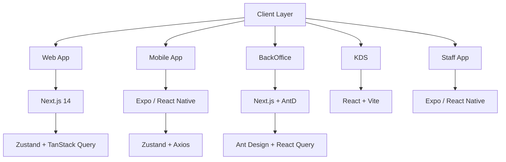
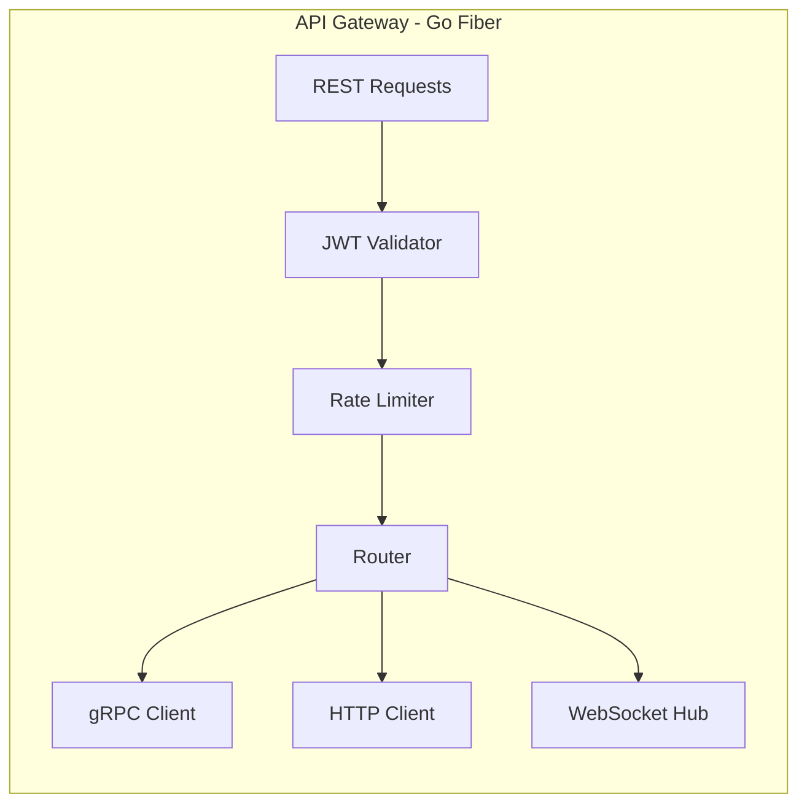
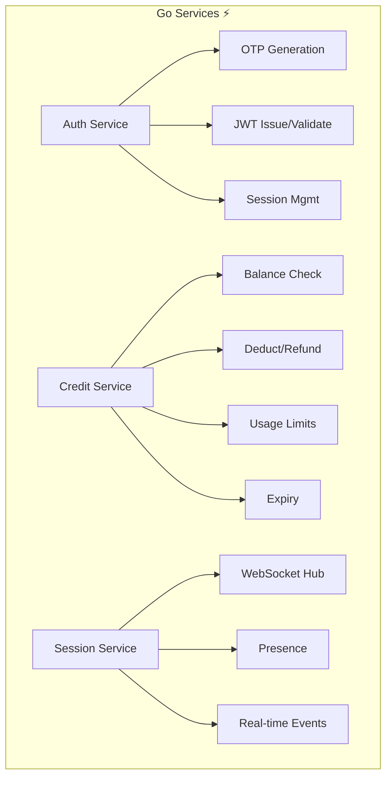
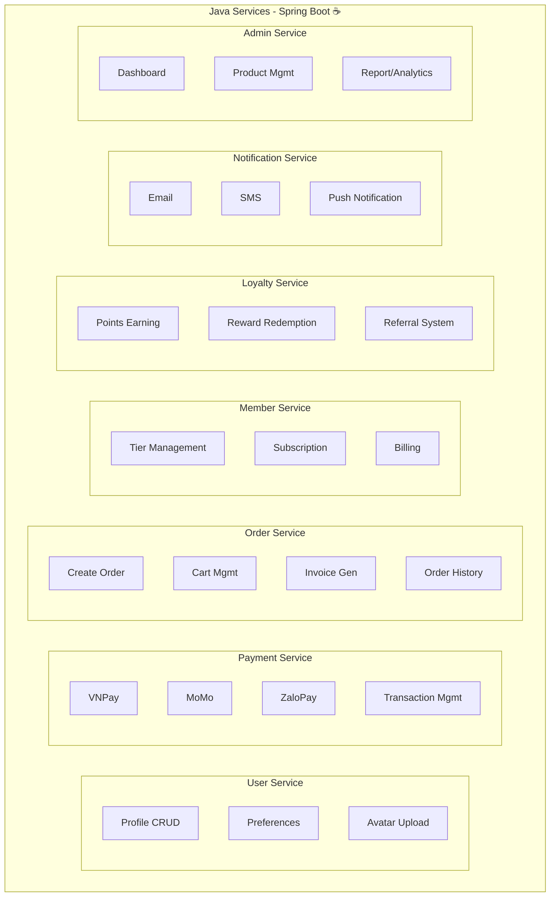
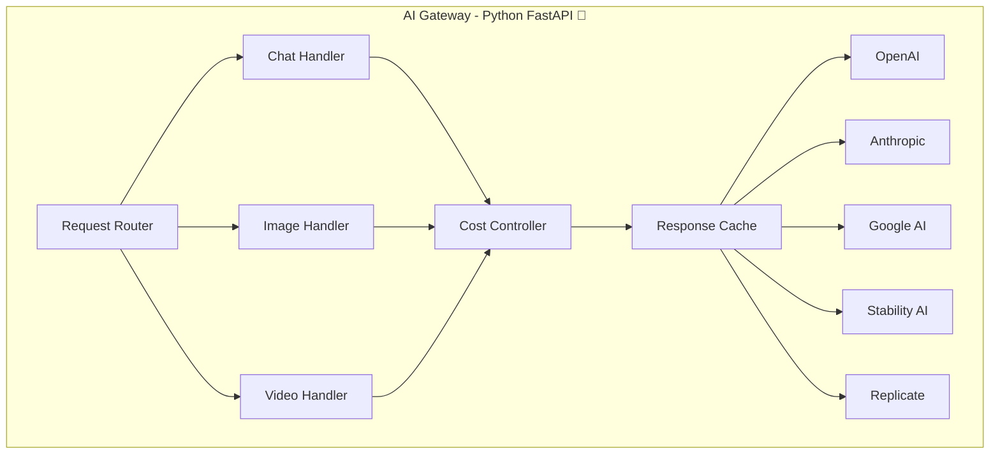
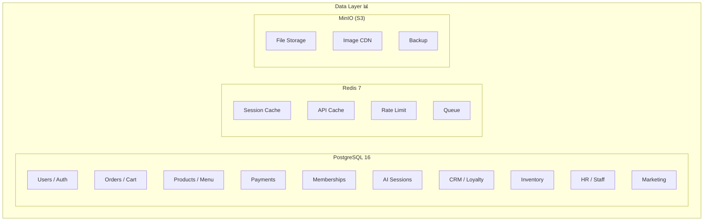
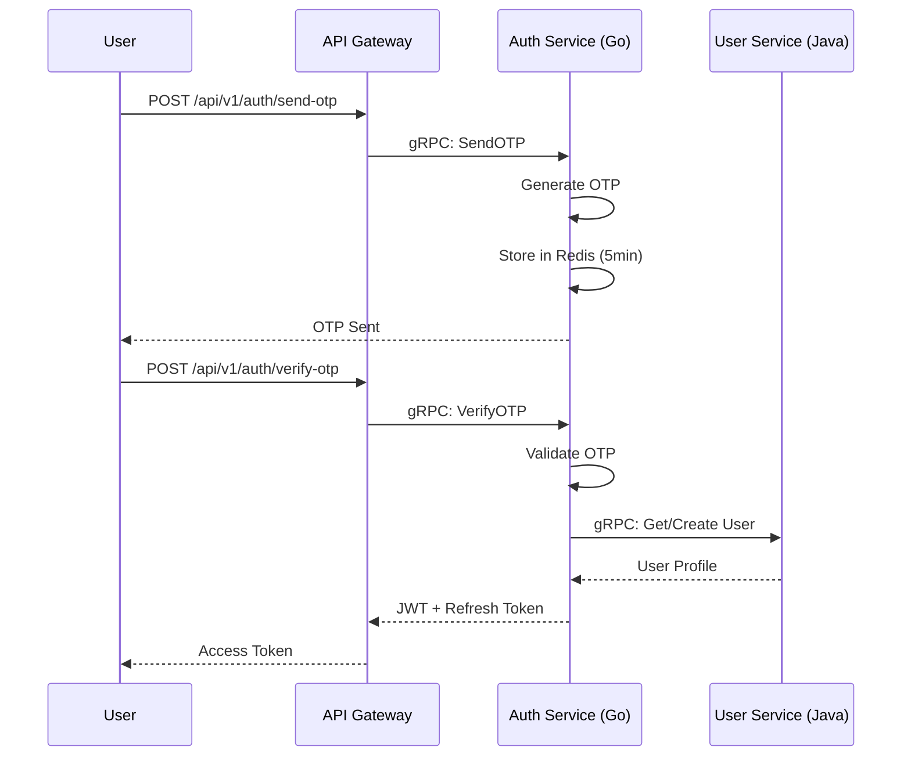
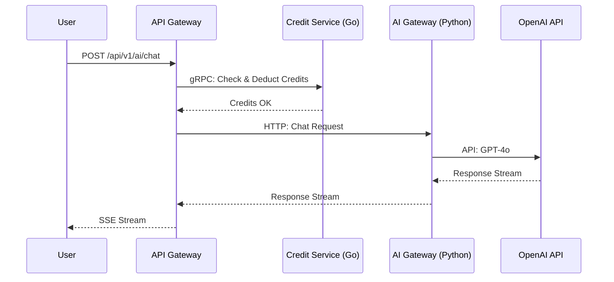
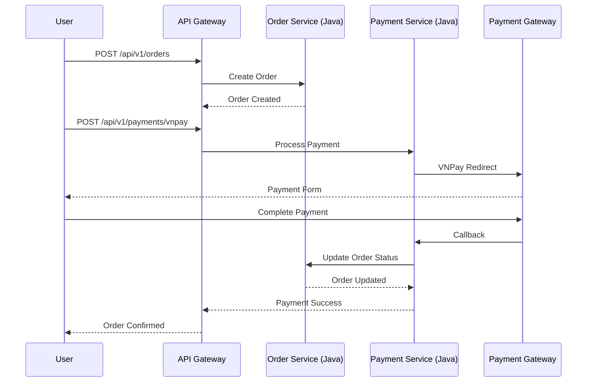

# AI Café Platform - Sơ đồ Kiến trúc Hệ thống

## 1. Tổng quan Kiến trúc

```
┌─────────────────────────────────────────────────────────────────────────────────────────────┐
│                                     AI CAFÉ PLATFORM - ARCHITECTURE                            │
├─────────────────────────────────────────────────────────────────────────────────────────────┤
│                                                                                              │
│  ┌───────────────────────────────────────────────────────────────────────────────────────┐  │
│  │                                    CLIENTS                                              │  │
│  │   ┌──────────┐  ┌──────────┐  ┌──────────┐  ┌──────────┐  ┌──────────┐              │  │
│  │   │   Web    │  │  Mobile  │  │BackOffice│  │   KDS    │  │ Staff App│              │  │
│  │   │ Next.js  │  │  Expo    │  │  Next.js │  │ React +  │  │   Expo   │              │  │
│  │   │    14    │  │ React N. │  │  + AntD  │  │  Vite    │  │ React N. │              │  │
│  │   └──────────┘  └──────────┘  └──────────┘  └──────────┘  └──────────┘              │  │
│  └───────────────────────────────────────────────────────────────────────────────────────┘  │
│                                              │                                              │
│                                              ▼                                              │
│  ┌───────────────────────────────────────────────────────────────────────────────────────┐  │
│  │                          🚪 API GATEWAY (GO) 🔥                                      │  │
│  │   ┌──────────┐  ┌──────────┐  ┌──────────┐  ┌──────────┐  ┌────────────────────────┐ │  │
│  │   │ REST API │  │WebSocket │  │ gRPC     │  │ Rate     │  │ JWT Auth / Routing     │ │  │
│  │   │ Handler  │  │ Handler  │  │ Gateway  │  │ Limiter  │  │ / Load Balancing       │ │  │
│  │   └──────────┘  └──────────┘  └──────────┘  └──────────┘  └────────────────────────┘ │  │
│  └───────────────────────────────────────────────────────────────────────────────────────┘  │
│                                              │                                              │
│         ┌───────────────────────────────────┼───────────────────────────────────┐          │
│         │                                   │                                   │          │
│         ▼                                   ▼                                   ▼          │
│  ┌─────────────────┐              ┌─────────────────┐              ┌─────────────────┐   │
│  │   GO SERVICES   │              │  JAVA SERVICES  │              │ PYTHON SERVICES │   │
│  │     ⚡          │              │      ☕          │              │       🧠       │   │
│  ├─────────────────┤              ├─────────────────┤              ├─────────────────┤   │
│  │ • Auth Service  │              │ • User Service  │              │ • AI Gateway    │   │
│  │ • Credit Svc   │              │ • Payment Svc   │              │ • Chat Handler  │   │
│  │ • Session Svc  │              │ • Order Service │              │ • Image Gen     │   │
│  │                 │              │ • Member Svc    │              │ • Video Gen     │   │
│  │                 │              │ • Loyalty Svc   │              │                 │   │
│  │                 │              │ • Notification  │              │                 │   │
│  │                 │              │ • Admin Service │              │                 │   │
│  └─────────────────┘              └─────────────────┘              └─────────────────┘   │
│                                              │                                              │
└──────────────────────────────────────────────┼──────────────────────────────────────────────┘
                                               │
                                               ▼
                    ┌──────────────────────────────────────────────────────────────────┐
                    │                      DATA LAYER 📊                                │
                    │  ┌─────────────┐  ┌─────────────┐  ┌─────────────┐  ┌─────────────┐ │
                    │  │ PostgreSQL  │  │    Redis   │  │    MinIO    │  │  BullMQ    │ │
                    │  │     16      │  │     7      │  │   (S3)      │  │   Queue    │ │
                    │  │  103 Tables │  │   Cache    │  │   Storage   │  │   Jobs     │ │
                    │  └─────────────┘  └─────────────┘  └─────────────┘  └─────────────┘ │
                    └──────────────────────────────────────────────────────────────────┘
                                               │
                                               ▼
                    ┌──────────────────────────────────────────────────────────────────┐
                    │                 EXTERNAL AI PROVIDERS 🌐                          │
                    │  ┌─────────┐  ┌─────────┐  ┌─────────┐  ┌─────────┐  ┌─────────┐  │
                    │  │ OpenAI  │  │Anthropic│  │ Google  │  │Stability│  │Replicate│  │
                    │  │ GPT-4o  │  │Claude 3.5│  │ Gemini  │  │   AI   │  │         │  │
                    │  └─────────┘  └─────────┘  └─────────┘  └─────────┘  └─────────┘  │
                    └──────────────────────────────────────────────────────────────────┘
```

## 2. Chi tiết từng Layer

### 2.1 Client Layer (Frontend Apps)



### 2.2 API Gateway Layer



### 2.3 Go Services Layer



### 2.4 Java Services Layer



### 2.5 AI Gateway Layer



### 2.6 Data Layer



## 3. Flow Communication

### 3.1 User Authentication Flow



### 3.2 AI Chat Flow



### 3.3 Order & Payment Flow



## 4. Database Schema Overview

### 4.1 Core Tables

| Module | Tables | Description |
|--------|--------|-------------|
| **Company** | 5 | Multi-tenant, regions, cafes, seats, staff |
| **Products** | 12 | Menu, variants, options, modifiers, recipes, combos |
| **Orders** | 7 | Orders, items, status, payments, cart |
| **Users** | 8 | User accounts, profiles, devices, sessions |
| **AI** | 8 | Models, sessions, messages, credits |
| **CRM** | 5 | Customers, loyalty, reviews |
| **Payment** | 6 | Transactions, refunds, payment methods |
| **Inventory** | 8 | Stock, suppliers, purchase orders, alerts |
| **Delivery** | 5 | Zones, partners, tracking |
| **Table Mgmt** | 5 | Sessions, reservations, waitlist |
| **KDS** | 3 | Kitchen display, order tracking |
| **Marketing** | 7 | Campaigns, segments, referrals |
| **HR** | 5 | Schedules, attendance, payroll |
| **Operations** | 5 | Print jobs, audit logs, notifications |
| **Extras** | 12 | Translations, files, subscriptions, events |
| **Analytics** | 4 | Daily summaries, metrics |

**Total: 103 tables**

## 5. Technology Stack Summary

```
┌────────────────────────────────────────────────────────────────────────────────┐
│                           AI CAFÉ PLATFORM - TECH STACK                      │
├────────────────────────────────────────────────────────────────────────────────┤
│                                                                                │
│  ┌──────────────────────────────────────────────────────────────────────────┐  │
│  │                            FRONTEND                                       │  │
│  │  ┌─────────────┐  ┌─────────────┐  ┌─────────────┐  ┌─────────────┐     │  │
│  │  │    Web      │  │   Mobile    │  │  BackOffice │  │     KDS     │     │  │
│  │  │  Next.js   │  │ Expo/RN     │  │  Next.js    │  │ React+Vite  │     │  │
│  │  │    14       │  │ Android/iOS │  │   + AntD    │  │             │     │  │
│  │  └─────────────┘  └─────────────┘  └─────────────┘  └─────────────┘     │  │
│  └──────────────────────────────────────────────────────────────────────────┘  │
│                                                                                │
│  ┌──────────────────────────────────────────────────────────────────────────┐  │
│  │                        BACKEND - GO (API Gateway)                         │  │
│  │  ┌─────────────┐  ┌─────────────┐  ┌─────────────┐  ┌─────────────┐     │  │
│  │  │  Go Fiber   │  │    gRPC     │  │    Redis    │  │    JWT      │     │  │
│  │  │    / Echo   │  │   Client    │  │   Client    │  │   Auth      │     │  │
│  │  └─────────────┘  └─────────────┘  └─────────────┘  └─────────────┘     │  │
│  └──────────────────────────────────────────────────────────────────────────┘  │
│                                                                                │
│  ┌──────────────────────────────────────────────────────────────────────────┐  │
│  │                       BACKEND - GO (Core Services)                         │  │
│  │  ┌─────────────┐  ┌─────────────┐  ┌─────────────┐                        │  │
│  │  │Auth Service │  │Credit Svc   │  │Session Svc  │                        │  │
│  │  │  • OTP      │  │ • Balance   │  │ • WebSocket │                        │  │
│  │  │  • JWT      │  │ • Deduct    │  │ • Presence  │                        │  │
│  │  └─────────────┘  └─────────────┘  └─────────────┘                        │  │
│  └──────────────────────────────────────────────────────────────────────────┘  │
│                                                                                │
│  ┌──────────────────────────────────────────────────────────────────────────┐  │
│  │                     BACKEND - JAVA (Spring Boot)                          │  │
│  │  ┌─────────────┐  ┌─────────────┐  ┌─────────────┐  ┌─────────────┐     │  │
│  │  │User Service │  │Payment Svc  │  │Order Service│  │Member Svc   │     │  │
│  │  ├─────────────┤  ├─────────────┤  ├─────────────┤  ├─────────────┤     │  │
│  │  │Loyalty Svc  │  │Notification │  │Admin Svc    │  │             │     │  │
│  │  └─────────────┘  └─────────────┘  └─────────────┘  └─────────────┘     │  │
│  └──────────────────────────────────────────────────────────────────────────┘  │
│                                                                                │
│  ┌──────────────────────────────────────────────────────────────────────────┐  │
│  │                       BACKEND - PYTHON (AI Gateway)                       │  │
│  │  ┌─────────────┐  ┌─────────────┐  ┌─────────────┐  ┌─────────────┐     │  │
│  │  │   FastAPI   │  │   Chat      │  │   Image     │  │   Video     │     │  │
│  │  │             │  │   Handler   │  │   Generator │  │   Generator │     │  │
│  │  └─────────────┘  └─────────────┘  └─────────────┘  └─────────────┘     │  │
│  └──────────────────────────────────────────────────────────────────────────┘  │
│                                                                                │
│  ┌──────────────────────────────────────────────────────────────────────────┐  │
│  │                            DATA LAYER                                     │  │
│  │  ┌─────────────┐  ┌─────────────┐  ┌─────────────┐  ┌─────────────┐     │  │
│  │  │ PostgreSQL  │  │    Redis    │  │    MinIO    │  │   BullMQ    │     │  │
│  │  │    16       │  │     7       │  │    (S3)     │  │   Queue     │     │  │
│  │  └─────────────┘  └─────────────┘  └─────────────┘  └─────────────┘     │  │
│  └──────────────────────────────────────────────────────────────────────────┘  │
│                                                                                │
└────────────────────────────────────────────────────────────────────────────────┘
```

## 6. Infrastructure

```
┌────────────────────────────────────────────────────────────────────────────────┐
│                           INFRASTRUCTURE                                       │
├────────────────────────────────────────────────────────────────────────────────┤
│                                                                                │
│  ┌──────────────────────────────────────────────────────────────────────────┐  │
│  │                         AWS SERVICES                                      │  │
│  │  ┌─────────────┐  ┌─────────────┐  ┌─────────────┐  ┌─────────────┐     │  │
│  │  │    ECS      │  │    RDS      │  │ ElastiCache │  │ CloudFront  │     │  │
│  │  │  Fargate    │  │ PostgreSQL  │  │    Redis    │  │    CDN      │     │  │
│  │  └─────────────┘  └─────────────┘  └─────────────┘  └─────────────┘     │  │
│  └──────────────────────────────────────────────────────────────────────────┘  │
│                                                                                │
│  ┌──────────────────────────────────────────────────────────────────────────┐  │
│  │                         CONTAINERIZATION                                 │  │
│  │  ┌─────────────┐  ┌─────────────┐  ┌─────────────┐                       │  │
│  │  │   Docker    │  │Docker Compose│  │    Nginx    │                       │  │
│  │  │             │  │ Local Dev    │  │   Reverse   │                       │  │
│  │  │             │  │             │  │   Proxy     │                       │  │
│  │  └─────────────┘  └─────────────┘  └─────────────┘                       │  │
│  └──────────────────────────────────────────────────────────────────────────┘  │
│                                                                                │
│  ┌──────────────────────────────────────────────────────────────────────────┐  │
│  │                         MONITORING                                       │  │
│  │  ┌─────────────┐  ┌─────────────┐  ┌─────────────┐  ┌─────────────┐     │  │
│  │  │Prometheus  │  │   Grafana    │  │CloudWatch   │  │ OpenTelemetry│     │  │
│  │  │  Metrics   │  │  Dashboard  │  │   Logs      │  │  Tracing    │     │  │
│  │  └─────────────┘  └─────────────┘  └─────────────┘  └─────────────┘     │  │
│  └──────────────────────────────────────────────────────────────────────────┘  │
│                                                                                │
│  ┌──────────────────────────────────────────────────────────────────────────┐  │
│  │                         CI/CD                                            │  │
│  │  ┌─────────────┐  ┌─────────────┐  ┌─────────────┐                       │  │
│  │  │   GitHub    │  │  Terraform  │  │ AWS Secrets │                       │  │
│  │  │   Actions   │  │    IaC      │  │   Manager   │                       │  │
│  │  └─────────────┘  └─────────────┘  └─────────────┘                       │  │
│  └──────────────────────────────────────────────────────────────────────────┘  │
│                                                                                │
└────────────────────────────────────────────────────────────────────────────────┘
```

## 7. Security Architecture

```
┌────────────────────────────────────────────────────────────────────────────────┐
│                           SECURITY LAYERS                                       │
├────────────────────────────────────────────────────────────────────────────────┤
│                                                                                │
│  1️⃣  NETWORK SECURITY                                                          │
│      ├── AWS WAF - Web Application Firewall                                   │
│      ├── CloudFront - DDoS Protection, CDN                                     │
│      ├── Security Groups - Network Access Control                              │
│      └── Private Subnets - Services Not Directly Exposed                       │
│                                                                                │
│  2️⃣  API GATEWAY SECURITY (Go)                                                │
│      ├── JWT Validation on Every Request                                        │
│      ├── Rate Limiting (100 req/min per user)                                  │
│      ├── Input Validation & Sanitization                                       │
│      ├── CORS Configuration                                                    │
│      └── Request Logging & Monitoring                                          │
│                                                                                │
│  3️⃣  SERVICE SECURITY                                                          │
│      ├── mTLS Between Services (gRPC)                                          │
│      ├── Service-to-Service Authentication                                    │
│      ├── Role-Based Access Control (RBAC)                                     │
│      └── API Key Validation for Internal Services                              │
│                                                                                │
│  4️⃣  DATA SECURITY                                                             │
│      ├── Encryption at Rest (PostgreSQL, Redis)                                │
│      ├── Encryption in Transit (TLS 1.3)                                       │
│      ├── Secrets Manager for Credentials                                       │
│      └── Row-Level Security in Database                                        │
│                                                                                │
│  5️⃣  APPLICATION SECURITY                                                      │
│      ├── SQL Injection Prevention (Parameterized Queries)                       │
│      ├── XSS Prevention (Input Sanitization)                                  │
│      ├── CSRF Protection                                                       │
│      ├── Secure Headers (HSTS, CSP, etc.)                                      │
│      └── Audit Logging                                                         │
│                                                                                │
└────────────────────────────────────────────────────────────────────────────────┘
```

---

**Document Version:** 1.0  
**Last Updated:** 2024  
**Author:** AI Café Platform Team
