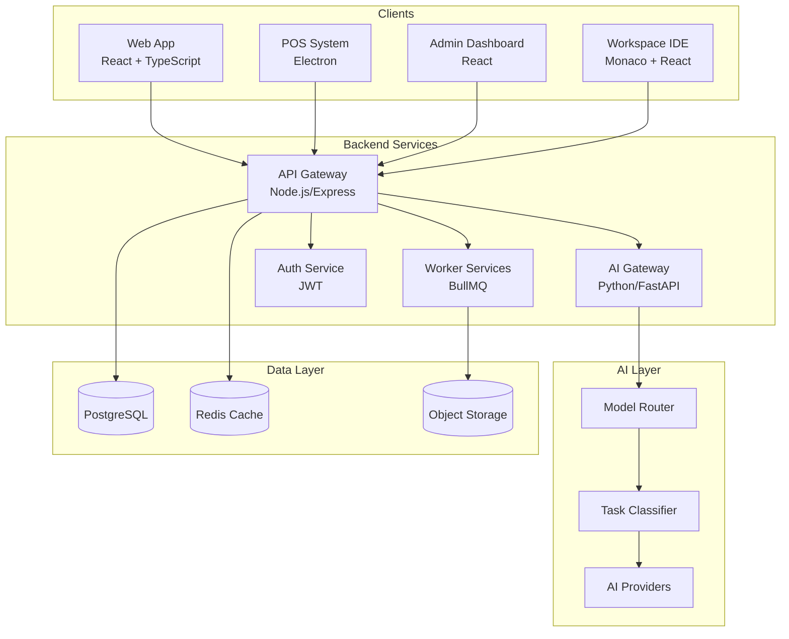
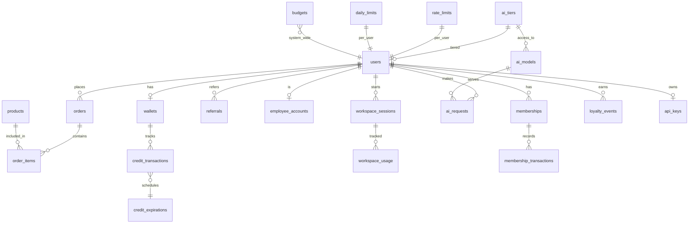
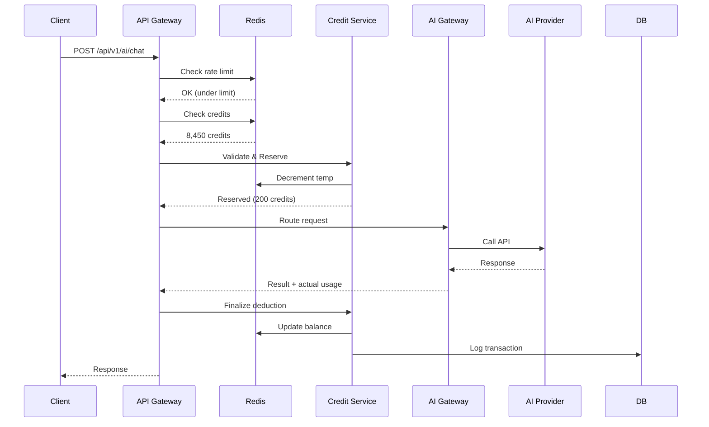
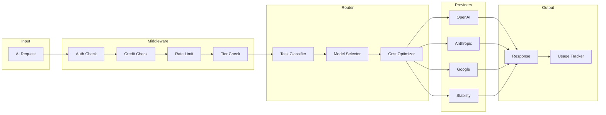
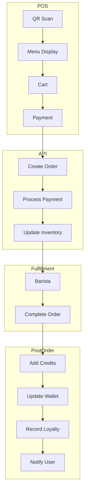
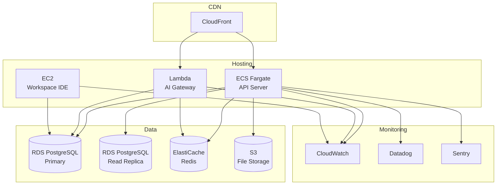
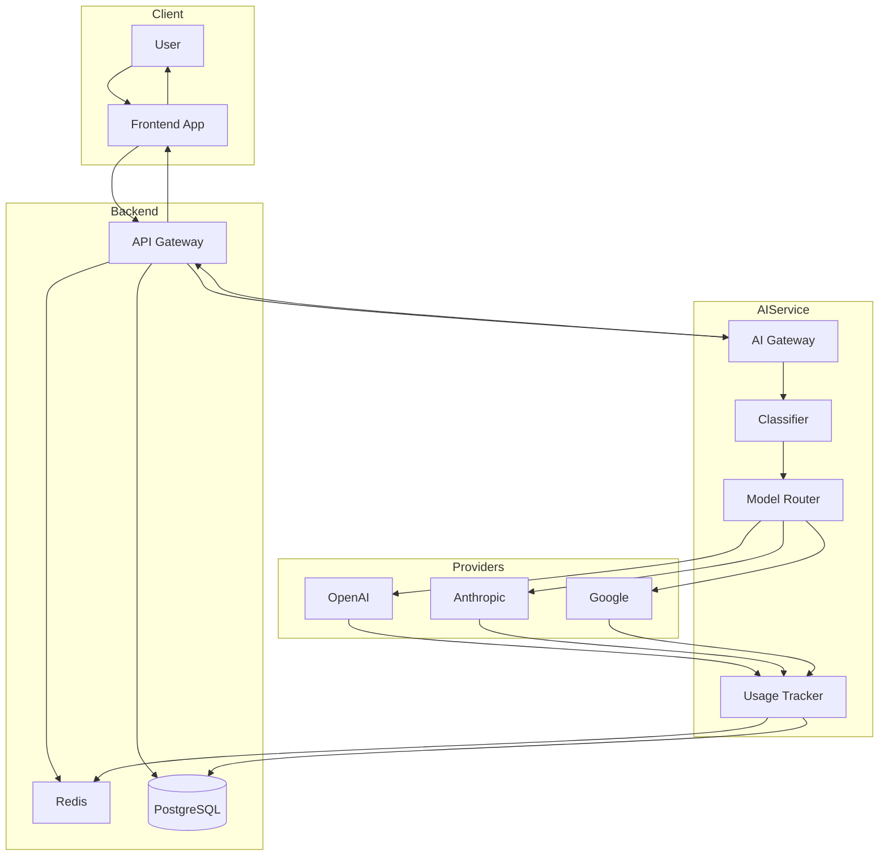
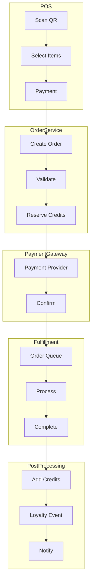
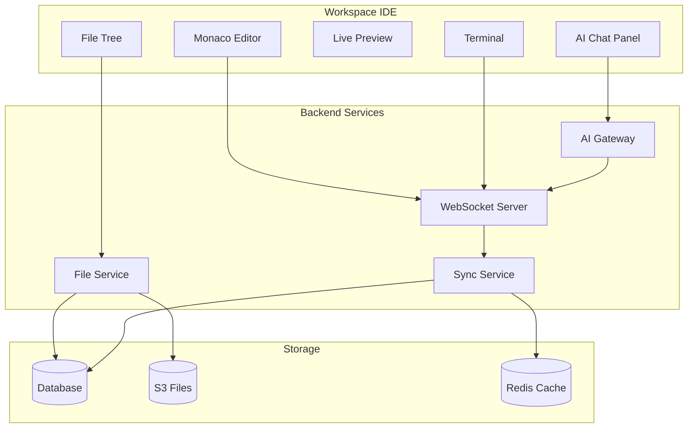
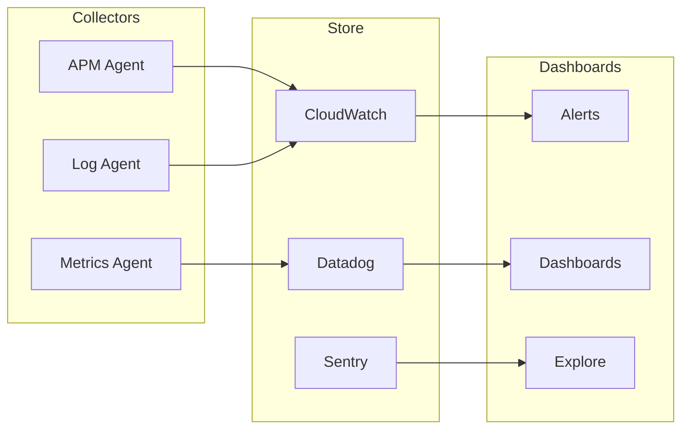

# AI Café Platform - System Design

## 1. High-Level Architecture



## 2. Frontend Architecture

### 2.1 Web Application (Customer-facing)

```
src/
├── app/                    # Next.js App Router
│   ├── (auth)/            # Auth routes
│   │   ├── login/
│   │   ├── register/
│   │   └── forgot-password/
│   ├── (main)/            # Protected routes
│   │   ├── dashboard/
│   │   ├── ai/
│   │   │   ├── chat/
│   │   │   ├── code/
│   │   │   ├── image/
│   │   │   └── video/
│   │   ├── workspace/
│   │   ├── wallet/
│   │   ├── orders/
│   │   └── settings/
│   └── page.tsx
├── components/
│   ├── ui/                # Base UI components
│   │   ├── button.tsx
│   │   ├── card.tsx
│   │   ├── input.tsx
│   │   ├── modal.tsx
│   │   └── ...
│   ├── features/         # Feature components
│   │   ├── ai-chat/
│   │   ├── code-editor/
│   │   ├── image-generator/
│   │   └── video-generator/
│   ├── layout/           # Layout components
│   └── shared/            # Shared components
├── hooks/                 # Custom hooks
│   ├── useAuth.ts
│   ├── useCredits.ts
│   ├── useAI.ts
│   └── useWebSocket.ts
├── lib/                   # Utilities
│   ├── api/
│   ├── utils/
│   └── constants/
├── stores/               # State management
│   ├── authStore.ts
│   ├── walletStore.ts
│   └── uiStore.ts
└── types/                # TypeScript types
```

### 2.2 POS System

```
pos/
├── src/
│   ├── main/             # Electron main process
│   ├── renderer/        # React frontend
│   │   ├── components/
│   │   │   ├── menu/
│   │   │   ├── cart/
│   │   │   ├── payment/
│   │   │   └── receipt/
│   │   ├── pages/
│   │   │   ├── order/
│   │   │   └── history/
│   │   └── App.tsx
│   └── preload/
├── electron-builder.json
└── package.json
```

### 2.3 Admin Dashboard

```
admin/
├── src/
│   ├── app/
│   │   ├── dashboard/
│   │   ├── users/
│   │   ├── orders/
│   │   ├── products/
│   │   ├── credits/
│   │   ├── analytics/
│   │   ├── settings/
│   │   └── reports/
│   └── layout.tsx
│   ├── components/
│   │   ├── charts/
│   │   ├── tables/
│   │   ├── forms/
│   │   └── modals/
│   ├── hooks/
│   │   ├── useAdminUsers.ts
│   │   ├── useAnalytics.ts
│   │   └── useReports.ts
│   └── lib/
│       └── api/
└── package.json
```

### 2.4 Workspace IDE

```
workspace/
├── src/
│   ├── app/
│   │   ├── [projectId]/
│   │   │   ├── page.tsx        # Main editor
│   │   │   ├── preview/
│   │   │   └── settings/
│   │   └── new/
│   └── layout.tsx
│   ├── components/
│   │   ├── editor/
│   │   │   ├── code-editor.tsx
│   │   │   ├── terminal.tsx
│   │   │   ├── file-tree.tsx
│   │   │   └── tabs.tsx
│   │   ├── ai/
│   │   │   ├── chat-panel.tsx
│   │   │   ├── completions.tsx
│   │   │   └── suggestions.tsx
│   │   ├── preview/
│   │   │   └── iframe.tsx
│   │   └── toolbar/
│   └── lib/
│       ├── websocket/
│       └── file-system/
└── package.json
```

## 3. Backend Architecture

### 3.1 API Gateway (Node.js/Express)

```
server/
├── src/
│   ├── index.ts                 # Entry point
│   ├── app.ts                   # Express app setup
│   ├── config/
│   │   ├── database.ts
│   │   ├── redis.ts
│   │   └── env.ts
│   ├── routes/
│   │   ├── v1/
│   │   │   ├── auth.routes.ts
│   │   │   ├── users.routes.ts
│   │   │   ├── orders.routes.ts
│   │   │   ├── credits.routes.ts
│   │   │   ├── ai.routes.ts
│   │   │   ├── workspace.routes.ts
│   │   │   ├── membership.routes.ts
│   │   │   └── admin.routes.ts
│   │   └── index.ts
│   ├── controllers/
│   │   ├── auth.controller.ts
│   │   ├── users.controller.ts
│   │   ├── orders.controller.ts
│   │   ├── credits.controller.ts
│   │   ├── ai.controller.ts
│   │   ├── workspace.controller.ts
│   │   ├── membership.controller.ts
│   │   └── admin.controller.ts
│   ├── services/
│   │   ├── auth.service.ts
│   │   ├── user.service.ts
│   │   ├── order.service.ts
│   │   ├── credit.service.ts
│   │   ├── wallet.service.ts
│   │   ├── membership.service.ts
│   │   └── notification.service.ts
│   ├── middleware/
│   │   ├── auth.middleware.ts
│   │   ├── rateLimit.middleware.ts
│   │   ├── creditCheck.middleware.ts
│   │   ├── admin.middleware.ts
│   │   └── error.middleware.ts
│   ├── models/
│   │   ├── User.ts
│   │   ├── Order.ts
│   │   ├── Wallet.ts
│   │   ├── CreditTransaction.ts
│   │   └── index.ts
│   ├── repositories/
│   │   ├── user.repository.ts
│   │   ├── order.repository.ts
│   │   ├── wallet.repository.ts
│   │   └── index.ts
│   ├── queues/
│   │   ├── creditExpiry.queue.ts
│   │   ├── notification.queue.ts
│   │   └── analytics.queue.ts
│   └── utils/
│       ├── logger.ts
│       ├── validator.ts
│       └── helpers.ts
├── prisma/
│   └── schema.prisma
├── tests/
└── package.json
```

### 3.2 AI Gateway Service (Python/FastAPI)

```
ai-gateway/
├── src/
│   ├── main.py                 # FastAPI entry point
│   ├── config.py
│   ├── api/
│   │   ├── routes/
│   │   │   ├── chat.py
│   │   │   ├── code.py
│   │   │   ├── image.py
│   │   │   └── video.py
│   │   └── dependencies.py
│   ├── core/
│   │   ├── router.py          # Model router
│   │   ├── classifier.py       # Task classifier
│   │   ├── limiter.py         # Rate limiter
│   │   └── tracker.py         # Usage tracker
│   ├── providers/
│   │   ├── base.py            # Base provider interface
│   │   ├── openai.py
│   │   ├── anthropic.py
│   │   ├── google.py
│   │   └── registry.py        # Provider registry
│   ├── services/
│   │   ├── chat.service.py
│   │   ├── code.service.py
│   │   ├── image.service.py
│   │   └── video.service.py
│   ├── schemas/
│   │   ├── requests.py
│   │   └── responses.py
│   └── utils/
│       ├── token_counter.py
│       └── cost_calculator.py
├── tests/
├── pyproject.toml
└── Dockerfile
```

### 3.3 Worker Services

```
workers/
├── src/
│   ├── index.ts                 # Worker entry
│   ├── queues/
│   │   ├── creditExpirer.ts    # Credit expiration job
│   │   ├── membershipBilling.ts  # Monthly billing
│   │   ├── referralProcessor.ts # Referral rewards
│   │   ├── loyaltyProcessor.ts  # Loyalty events
│   │   ├── analyticsAggregator.ts
│   │   ├── notificationSender.ts
│   │   └── videoProcessor.ts   # Video generation
│   ├── processors/
│   │   └── index.ts
│   └── utils/
│       └── helpers.ts
└── package.json
```

## 4. Database Design

### 4.1 Entity Relationship Diagram



### 4.2 Table Definitions

```sql
-- Core tables (PostgreSQL)
-- See DATABASE_SCHEMA.md for full definitions

-- Key Tables:
-- users, products, orders, order_items
-- wallets, credit_transactions, credit_expirations
-- ai_tiers, ai_models, model_pricing, ai_requests
-- provider_accounts, provider_usage
-- workspace_sessions, workspace_usage
-- memberships, membership_transactions
-- referrals, loyalty_events
-- rate_limits, daily_limits, budgets
-- api_keys, audit_logs
```

### 4.3 Redis Caching Strategy

```
┌─────────────────────────────────────────────────────────┐
│                    Redis Key Patterns                   │
├─────────────────────────────────────────────────────────┤
│                                                         │
│  Session & Auth                                         │
│  ─────────────────                                      │
│  session:{userId}           → JWT token data (TTL: 24h)│
│  refresh:{userId}          → Refresh token (TTL: 7d)  │
│  rate:{userId}:{endpoint}  → Request count (TTL: 1m)  │
│                                                         │
│  Wallet & Credits                                       │
│  ──────────────────                                    │
│  wallet:{userId}            → Cached balance (TTL: 5m) │
│  daily:{userId}:{date}     → Daily usage (TTL: 25h)   │
│  limit:{userId}:{type}     → Rate limit counters      │
│                                                         │
│  AI & Usage                                             │
│  ──────────                                             │
│  quota:{userId}:video:{date} → Video quota (TTL: 25h) │
│  model:health:{provider}    → Provider status (TTL: 1m)│
│  cost:daily                → Daily cost (TTL: 26h)    │
│  cost:monthly              → Monthly cost (TTL: 32d)  │
│                                                         │
│  Workspace                                              │
│  ─────────                                              │
│  workspace:{sessionId}       → Session state (TTL: 8h)│
│  files:{userId}:{project}   → File cache (TTL: 1h)   │
│                                                         │
│  Rate Limiting                                          │
│  ──────────────                                         │
│  rpm:{userId}               → Requests/min (TTL: 1m)  │
│  tpm:{userId}               → Tokens/min (TTL: 1m)   │
│  concurrent:{userId}        → Concurrent count          │
│                                                         │
└─────────────────────────────────────────────────────────┘
```

## 5. API Design

### 5.1 API Gateway Pattern

```
┌─────────────────────────────────────────────────────────────┐
│                      API Gateway                            │
├─────────────────────────────────────────────────────────────┤
│                                                             │
│  ┌─────────┐    ┌─────────┐    ┌─────────┐    ┌─────────┐ │
│  │ Auth    │    │ Rate    │    │ Credit  │    │ Request │ │
│  │ Filter  │ → │ Limit   │ →  │ Check   │ →  │ Proxy   │ │
│  └─────────┘    └─────────┘    └─────────┘    └─────────┘ │
│       ↓                                        ↓           │
│       │                                        │           │
│       ▼                                        ▼           │
│  ┌─────────┐                           ┌─────────────┐  │
│  │ Session  │                           │ AI Gateway  │  │
│  │ Store    │                           │ (Python)    │  │
│  └─────────┘                           └─────────────┘  │
│                                                ↓           │
│                                                ▼           │
│                                        ┌─────────────┐    │
│                                        │ AI Provider │    │
│                                        │ (OpenAI,    │    │
│                                        │  Anthropic) │    │
│                                        └─────────────┘    │
└─────────────────────────────────────────────────────────────┘
```

### 5.2 Request Flow



## 6. Component Diagrams

### 6.1 AI Gateway Components



### 6.2 Order Flow Components



## 7. Infrastructure

### 7.1 Deployment Architecture



### 7.2 Technology Stack

| Layer | Technology | Purpose |
|-------|------------|---------|
| **Frontend** | | |
| Web App | Next.js 14, React, TypeScript | Customer-facing app |
| POS | Electron, React | Point of Sale |
| Admin | Next.js 14, React, TypeScript | Admin dashboard |
| Workspace | Monaco Editor, React | Code editor |
| **Backend** | | |
| API Server | Node.js, Express, Fastify | REST API |
| AI Gateway | Python, FastAPI | AI processing |
| Workers | Node.js, BullMQ | Background jobs |
| Auth | JWT, Redis | Authentication |
| **Data** | | |
| Primary DB | PostgreSQL 15 | Transactional data |
| Cache | Redis 7 | Session, cache |
| File Storage | S3 | Images, files |
| Search | PostgreSQL (full-text) | Search |
| **Infrastructure** | | |
| Hosting | AWS ECS, Lambda | Compute |
| CDN | CloudFront | Static assets |
| Monitoring | CloudWatch, Datadog | Observability |
| CI/CD | GitHub Actions | Deployment |

## 8. Security Architecture

### 8.1 Security Layers

```
┌─────────────────────────────────────────────────────────┐
│                    Security Layers                       │
├─────────────────────────────────────────────────────────┤
│                                                         │
│  Layer 1: Network Security                            │
│  ────────────────────────────                            │
│  • VPC with private subnets                            │
│  • Security groups (least privilege)                    │
│  • WAF for API protection                              │
│  • DDoS protection (CloudFront)                        │
│                                                         │
│  Layer 2: Application Security                        │
│  ─────────────────────────────                          │
│  • JWT with short expiry (15m)                        │
│  • Refresh token rotation                              │
│  • Rate limiting per user/IP                           │
│  • Input validation (Zod)                             │
│  • CSRF protection                                     │
│                                                         │
│  Layer 3: Data Security                               │
│  ───────────────────────                               │
│  • Encryption at rest (AES-256)                       │
│  • Encryption in transit (TLS 1.3)                     │
│  • API keys encrypted (KMS)                           │
│  • No AI prompts stored (privacy)                     │
│  • PII data encrypted                                  │
│                                                         │
│  Layer 4: Monitoring                                   │
│  ──────────────────                                   │
│  • Anomaly detection                                   │
│  • Fraud signals monitoring                            │
│  • Audit logging                                       │
│  • Alert on suspicious activity                        │
│                                                         │
└─────────────────────────────────────────────────────────┘
```

## 9. Data Flow Diagrams

### 9.1 AI Request Flow



### 9.2 Order Processing Flow



## 10. Workspace Architecture

### 10.1 Workspace Components



### 10.2 Session Management

```
┌─────────────────────────────────────────────────────────┐
│               Workspace Session Flow                   │
├─────────────────────────────────────────────────────────┤
│                                                         │
│  1. Start Session                                       │
│     POST /workspace/sessions                           │
│     → Check workspace time remaining                   │
│     → Create session record                            │
│     → Initialize Redis state                           │
│     → Return session credentials                       │
│                                                         │
│  2. Active Session                                      │
│     WebSocket connection established                    │
│     Heartbeat every 30s                                │
│     Track active time                                  │
│     Auto-save every 30s                               │
│                                                         │
│  3. AI Usage                                           │
│     Deduct from credits pool                           │
│     Track per-task usage                               │
│     Apply rate limits                                  │
│                                                         │
│  4. End Session                                         │
│     Manual: User clicks End                           │
│     Auto: Time expires                                 │
│     Save final state                                   │
│     Calculate total usage                              │
│     Return remaining time                              │
│                                                         │
└─────────────────────────────────────────────────────────┘
```

## 11. Real-time Features

### 11.1 WebSocket Architecture

```
┌─────────────────────────────────────────────────────────┐
│                 WebSocket Architecture                   │
├─────────────────────────────────────────────────────────┤
│                                                         │
│  ┌─────────┐                                           │
│  │ Clients │  React App, Workspace IDE, POS          │
│  └────┬────┘                                           │
│       │                                                │
│       ▼                                                │
│  ┌─────────────┐    ┌─────────────┐                   │
│  │ Load Balancer│    │   Redis     │                   │
│  │ (ALB)       │    │  Pub/Sub    │                   │
│  └──────┬──────┘    └──────┬──────┘                   │
│         │                   │                          │
│         ▼                   ▼                          │
│  ┌─────────────────────────────────────┐             │
│  │         WebSocket Server             │             │
│  │  ┌─────────┐  ┌─────────┐  ┌─────┐ │             │
│  │  │ Chat    │  │ Workspace│  │Order│ │             │
│  │  │ Handler │  │ Handler │  │Handler│ │             │
│  │  └─────────┘  └─────────┘  └─────┘ │             │
│  └─────────────────────────────────────┘             │
│                      │                                │
│                      ▼                                │
│               ┌─────────────┐                         │
│               │   Redis     │                         │
│               │  Channels   │                         │
│               └─────────────┘                         │
│                      │                                │
│                      ▼                                │
│  ┌─────────┐  ┌─────────┐  ┌─────────┐             │
│  │  Chat   │  │Workspace │  │  Order   │             │
│  │ Service │  │ Service  │  │ Service  │             │
│  └────┬────┘  └────┬────┘  └────┬────┘             │
│       │            │            │                    │
└───────┼────────────┼────────────┼────────────────────┘
        │            │            │
        ▼            ▼            ▼
    ┌───────┐    ┌───────┐    ┌───────┐
    │ AI    │    │ File  │    │ Order │
    │ GW    │    │ Store │    │ Queue │
    └───────┘    └───────┘    └───────┘
```

## 12. Monitoring & Observability

### 12.1 Metrics Dashboard



### 12.2 Key Metrics

| Category | Metrics | Alert Threshold |
|----------|---------|-----------------|
| **Business** | | |
| Orders | count, revenue | < 50/day |
| Active Users | DAU, MAU | < 50 DAU |
| Credits | issued, used, expired | > 90% expired |
| **Technical** | | |
| API | latency p50/p95/p99, error rate | p99 > 2s, error > 1% |
| AI | cost/day, cost/user, latency | cost > budget |
| Database | connections, query time | connections > 80% |
| **Security** | | |
| Fraud | suspicious activity rate | > 5% |
| Rate Limit | blocked requests | > 100/min |
| Auth | failed logins | > 10/min |

## 13. File Structure Summary

```
AI-Cafe-Platform/
├── frontend/
│   ├── web/                 # Customer web app (Next.js)
│   ├── pos/                 # POS system (Electron)
│   ├── admin/               # Admin dashboard (Next.js)
│   └── workspace/           # IDE (React + Monaco)
├── backend/
│   ├── api-gateway/         # REST API (Node.js)
│   ├── ai-gateway/          # AI processing (Python)
│   └── workers/             # Background jobs (Node.js)
├── infrastructure/
│   ├── terraform/           # Infrastructure as Code
│   ├── docker/              # Docker configs
│   └── k8s/                 # Kubernetes configs
├── docs/
│   ├── SYSTEM_DESIGN.md     # This file
│   ├── *.md                 # Other documentation
└── README.md
```

## 14. Implementation Priority

### Phase 1: Core MVP
1. **Database Schema** - PostgreSQL setup
2. **Auth System** - JWT, session management
3. **User & Wallet** - Core user flows
4. **Order System** - Basic ordering
5. **Credit Engine** - Credits management
6. **AI Gateway** - Single provider (OpenAI)
7. **Chat Interface** - Basic AI chat
8. **Web Frontend** - Customer app

### Phase 2: Growth
1. **POS System** - In-store ordering
2. **Model Router** - Multi-provider
3. **Image Generation** - Add image AI
4. **Workspace** - Basic workspace
5. **Membership** - Subscription system
6. **Loyalty** - Rewards program
7. **Admin Dashboard** - Management tools

### Phase 3: Scale
1. **Video Generation** - Video AI
2. **Advanced Workspace** - Full IDE features
3. **Public API** - Developer access
4. **Analytics** - Business intelligence
5. **Multi-tenant** - Organization accounts
